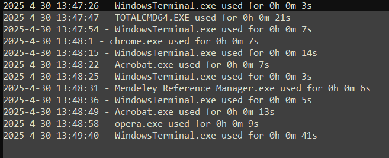

## App Usage Logger (Console-based)

This **C++ console application** logs the usage duration of non-Windows applications focused by the user. It logs both to the **console** and to a file at `C:\ProgramData\applog.txt`.

---

## Features

- Detects the currently focused application window.
- Ignores system/Windows internal apps.
- Tracks usage duration for each app.
- Logs to:
  - **Console** (for live feedback)
  - **File**: `C:\ProgramData\applog.txt`
- Gracefully exits with **Ctrl+C**.

---

## Prerequisites

- Windows (tested on **Windows 10/11**)
- **Visual Studio** (with C++ workload)
- Run the application as **Administrator**

---

## Building the Application

1. Open **Visual Studio**.
2. Create a new **Console App** project.
3. Replace the contents of `main.cpp` with the code below.
4. Build and run.

---

## Log File Output

- **File**: `C:\ProgramData\applog.txt`
- Example entry:

```yaml
2025-04-30 14:52:01 - chrome.exe used for 0h 3m 17s
```

---

## How to Test

1. Build and run the app as **Administrator**.
2. Open and switch between several non-Windows apps (e.g., Chrome, Notepad++).
3. Watch logs appear in the **console**.
4. Press **Ctrl+C** to exit.
5. Check the file at `C:\ProgramData\applog.txt`.

## Result
if success, the applog contains data like this



## Next to do
- run the service in the background
- Do not write logs in the console
- Send applog.txt via email when the computer boots
